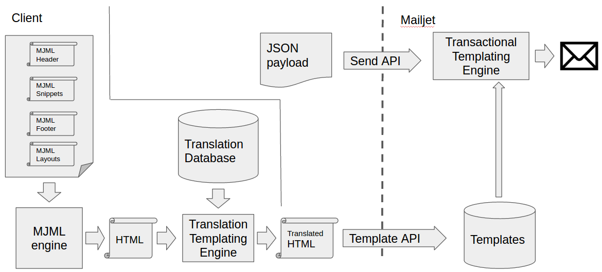

# Building a multi-brand and multilanguage transactional templates generation solution 

This Proof-Of-Concept (POC) will show you how to leverage [MJML](https://mjml.io) - Mailjet open source framework that makes responsive email easy - to facilitate the management of reusable responsive templates snippets. 



Following this guide, you'll learn how-to:
- Process MJML to get an HTML email
- Substitution of translation placeholders with a database of transalation (to make it easier here we are using PHP files to store the different languages)
- Creation or update of a template through Mailjet API 

The MJML templates will also be able to accommodate Mailjet Templating Language as described [here](https://dev.mailjet.com/template-language/mjml/).

This project contain several folders : 
- [input](https://github.com/eboisgon/MJML_translation_for_transactional/tree/master/input) : contains all the MJML files used to represent the final messages.
- [output](https://github.com/eboisgon/MJML_translation_for_transactional/tree/master/output) : contains the result of MJML processing, still containing the translation placeholders.
- [output_trans](https://github.com/eboisgon/MJML_translation_for_transactional/tree/master/output_trans) : contains the rendered templates to store at Mailjet.
- [trans](https://github.com/eboisgon/MJML_translation_for_transactional/tree/master/trans) : contains the translation indexes, one file per language. 

## MJML usage

In order to pool some parts of the template (header, footer, snippets), we are leveraging here the use of the [`<mj-include>`](https://mjml.io/documentation/#mj-include) MJML tag. It allows to load external files to build your email template. Visit (MJML documentation)[https://mjml.io/documentation/#mj-include] to learn more.

As a naming convention all headers, footers and snippets are prefixed with an `_` and will not be taken in account by the script. 

## Translation

This example relies on text based transalation sources (in `/trans` folder) but could be modified to use a proper third party storage. To avoid any conflict between the Mailjet templating language and the translation placeholders, the substitution tags for the translation are surrounded by `[[ ]]`. 

## Storing the final templates at Mailjet

The script in its last stage will store the HTML - after being translated - on a [Mailjet](https://mailjet.com) account using [Mailjet API](https://dev.mailjet.com). 
You can find more details about the Mailjet Template API [here](https://dev.mailjet.com/guides/#template-api).
The storage and maintenance of the template is relying on a naming convention of the template inherited from the original file in the `/input` folder: `/input/Filename.mjml => /output/Filename.html => /output_trans/Filename_$lg.html => Filename_$lg templates`

## Mailjet Transactional calls 

By using the name of the template in the Mailjet Send API call, it will be possible to directly send a message with the template without having to remember the numerical id of the given template. Here's a sample call using cUrl: 

```shell
curl -s \
  -X POST \
  --user "$MJ_APIKEY_PUBLIC:$MJ_APIKEY_PRIVATE" \
  https://api.mailjet.com/v3/send \
  -H 'Content-Type: application/json' \
  -d '{
    "FromEmail": "pilot@mailjet.com",
    "FromName": "Emmanuel",
    "Subject": "Receipt",
    "MJ-TemplateID": "brand3_reg_confirmation_fr",
    "MJ-TemplateLanguage": true,
    "MJ-TemplateErrorReporting": "pilot+error@mailjet.com",
    "MJ-TemplateErrorDeliver": "deliver",
    "Recipients": [
      {
        "Email": "passenger@mailjet.com"
      }
    ],
    "Vars": {
      "order": {
        "items": [
          {
            "title": "Brown shoes",
            "image_URL": "http://bit.ly/mj-tpl-tuto-shoes-simple",
            "price": {
              "currency": "$",
              "separator": ".",
              "amount": 79.99
            },
            "size": "9.5",
            "quantity": 1
          },
          {
            "title": "Blue T-shirt",
            "image_URL": "http://bit.ly/mj-tpl-lang-tuto-tshirt-simple",
            "price": {
              "currency": "$",
              "separator": ".",
              "amount": 29.99
            },
            "size": "S",
            "quantity": 1
          }
        ]
      }
    }
}'
```


## Install and Run 

This script has the following dependencies: 
* [Mailjet PHP wrapper](https://github.com/mailjet/mailjet-apiv3-php)
* [MJML CLI](https://github.com/mjmlio/mjml)

To install the [Mailjet PHP wrapper](https://github.com/mailjet/mailjet-apiv3-php), run the following command from your local copy folder: `composer install`

To install the MJML CLI, run the following command from your local copy folder: `npm install mjml`
You can learn more visiting [MJML documentation](https://mjml.io/documentation/#installation) 

Configuration keys to edit in [`conf.php`](https://github.com/mailjet/MJML_translation_for_transactional/blob/master/conf.php):
 - Mailjet API keys. You can retrieve them [here](https://app.mailjet.com/account/api_keys).
 - Set the path to MJML CLI in `$path_mjml`

You're all set! You now just need to run the following command: `php process.php`

# Conclusion

Here we are! We hoped this tutorial was helpful to you. Now, you should be able to take it from here and leverage our Transactional suite to build responsive, highly personalised email templates.
We'd love to have your feedback about this tutorial, so ping us on [Twitter](https://twitter.com/mailjetdev) or come and chat on the [MJML slack](https://slack.mjml.io) team!

You want to be informed about other tutorials and nice tech articles? Subscribe to our [dev only newsletter](https://dev.mailjet.com/#newsletter) to stay tuned!


